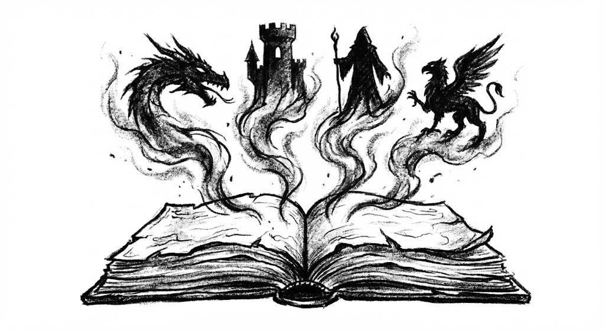
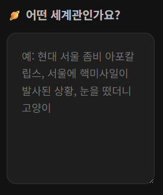
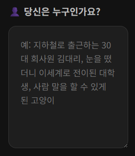
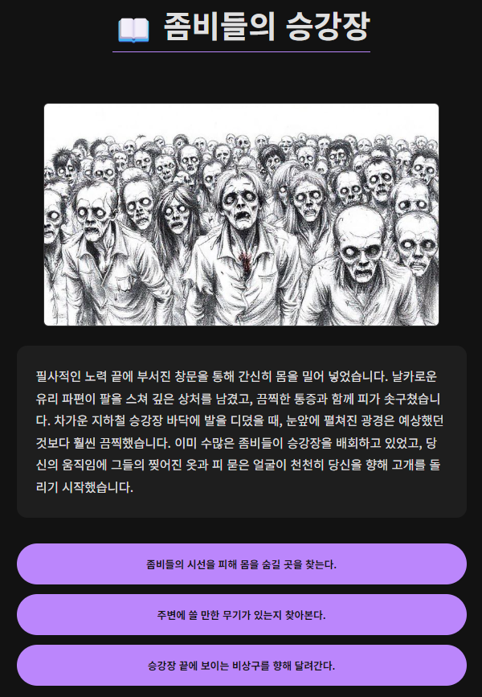

# UCTale (User Create Tale)

> **"당신이 만들어가는 이야기, AI가 그려내는 세상"**

UCTale은 사용자가 설정한 자유로운 세계관 속에서 AI가 실시간으로 스토리와 삽화를 창작해주는 텍스트 어드벤처 게임입니다.

플레이어의 선택에 따라 실시간으로 변화하는 **흑백 스케치 스타일의 삽화**와 **몰입감 넘치는 스토리**를 경험해보세요.

🔗 **배포 링크:** [https://uctale.vercel.app/](https://uctale.vercel.app/)

---

## 📸 게임 미리보기 (Preview)

### 🕹️ 게임 시작 (Intro)
|                 **자유로운 세계관 설정**                 |                   **나만의 주인공 생성**                    |
|:-----------------------------------------------:|:---------------------------------------------------:|
|  |  |
| 좀비 아포칼립스부터 이세계 전생까지, 당신이 상상하는 모든 세계를 입력하세요.  |  직업, 나이, 성격, 숨겨진 능력까지! 이야기를 이끌어갈 주인공을 직접 묘사하세요.  |
### 🎨 실시간 AI 이미지 생성
|                  몬스터 조우 (생성 예시)                   | 
|:-------------------------------------------------:| 
|  | 
|     *Flux 모델을 활용한 Rough Charcoal Sketch 스타일*      | 

---

## 🚀 프로젝트 개요

* **주제:** LLM 기반의 생성형 텍스트 어드벤처 (AI-TRPG)
* **핵심 기능:**
    * **자유도 무한대:** "좀비 아포칼립스", "이세계 전생", "사이버펑크" 등 원하는 모든 세계관 구현 가능
    * **멀티모달 경험:** 텍스트 진행 상황을 분석하여 가장 중요한 장면(캐릭터, 아이템, 배경)을 시각화
    * **장르적 일관성:** 시스템 프롬프트 엔지니어링을 통해 세계관 붕괴 방지

## 🛠 기술 스택 (Tech Stack)

| 분류 | 기술 | 비고 |
| :--- | :--- | :--- |
| **Frontend** | React, Vite | Vercel 배포, 반응형 UI |
| **Backend** | Java 21, Spring Boot | Render 배포, REST API |
| **Database** | H2 Database | 세션 및 로그 저장 (In-Memory) |
| **AI (Text)** | Google Gemini 2.5 Flash | 스토리 진행, 선택지 생성 |
| **AI (Image)** | Pollinations.ai (Flux) | 실시간 삽화 생성 |

## 📋 주요 기능

### 1. 게임 초기화
- 사용자가 입력한 '세계관'과 '캐릭터' 정보를 바탕으로 **Gemini**가 오프닝 스토리를 창작합니다.
- 오프닝 분위기에 맞는 첫 번째 삽화를 생성합니다.

### 2. 인터랙티브 진행
- 플레이어는 3가지 선택지 중 하나를 골라 이야기를 전개합니다.
- **JSON Mode**를 활용하여 AI 응답을 정형화된 데이터로 파싱, 안정적인 서비스를 제공합니다.

### 3. 동적 이미지 생성 전략
- 매 턴마다 무조건 이미지를 생성하지 않고, **시각적 가치가 있는 요소(등장인물, 아이템)**가 있을 때만 선별적으로 생성하여 리소스를 최적화합니다.
- 생성된 이미지는 **Charcoal Sketch 스타일**로 통일되어 독특한 분위기를 자아냅니다.

---