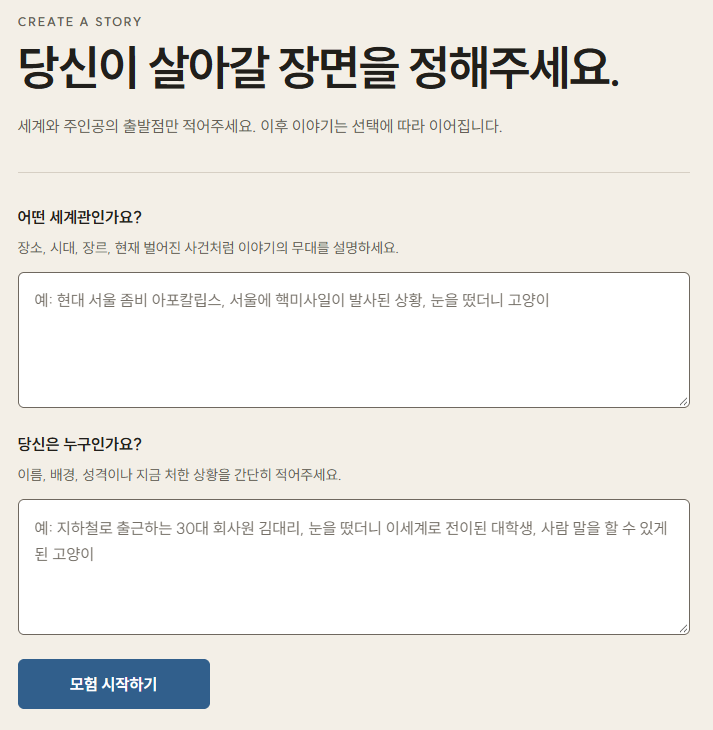
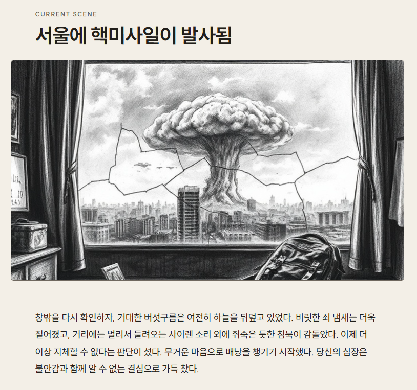
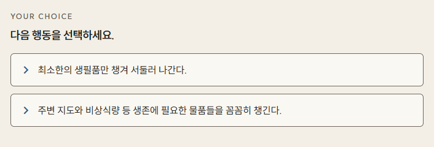

# UCTale

<div align="center">
  
</div>

> **당신이 세계를 만들고, 선택하고, 그 선택으로 하나의 이야기를 만들어가는 인터랙티브 스토리 서비스.**

UCTale은 정해진 시나리오를 따라가는 대신, 사용자가 직접 세계와 주인공의 출발점을 만들고 선택을 이어가며 자신만의 이야기를 만들어가는 서비스입니다.

[UCTale 시작하기](https://uctale.vercel.app/)

---

## 당신의 이야기로 시작합니다

### 1. 세계와 주인공을 정합니다



어떤 세계인지, 그리고 그 안에서 당신이 누구인지만 정하면 이야기가 시작됩니다.

판타지 왕국의 용병이 될 수도 있고, 재난이 시작된 도시의 평범한 시민이 될 수도 있습니다. 출발점은 사용자가 직접 만듭니다.

### 2. 장면이 이어집니다



모험을 시작하거나 선택지를 누르면 다음 장면이 출력됩니다. 현재 상황을 담은 이야기와 장면 이미지가 함께 제공됩니다.

### 3. 다음 행동을 선택합니다



현재 상황에서 무엇을 할지 선택하세요. 같은 출발점에서도 어떤 행동을 고르느냐에 따라 이야기는 다른 방향으로 이어집니다.

---

## 선택이 쌓여 하나의 Tale이 됩니다

UCTale에서 중요한 것은 정답을 찾는 것이 아니라 **내가 어떤 선택을 했는지**입니다.

세계와 주인공을 만들고, 눈앞의 상황에 반응하고, 그 결과를 받아들이며 다음 선택으로 나아갑니다. 그렇게 이어진 장면들이 사용자만의 이야기가 됩니다.

---

## 서비스 동작 원칙

UCTale은 이야기의 중요한 상태와 판정을 서버에서 관리하고, AI는 서버가 확정한 결과를 바탕으로 장면을 서술합니다.

- 사용자의 선택, 성공과 실패, 능력치, 아이템, 전투 결과와 같은 상태 변화는 서버 규칙으로 결정합니다.
- 같은 요청이 반복되거나 재시도되더라도 하나의 결과가 중복 적용되지 않도록 관리합니다.
- AI는 이야기와 장면을 표현하는 역할을 담당하며, 확정된 상태를 임의로 다시 판정하지 않습니다.
- 저장된 상태와 기록을 바탕으로 사용자가 이어서 이야기를 진행할 수 있도록 구성되어 있습니다.

## 현재 구현 요약

현재 서비스에는 선택 기반 이야기 진행을 중심으로 다음 기능이 구현되어 있습니다.

- 선택 행동과 Skill Check
- Inventory / Equipment
- HP / MP / Status Effect
- Combat / Ability
- Quest / Objective / World·Event Flag
- NPC Relationship / Affinity
- 이야기 상태 저장, snapshot, recovery
- Story Memory와 최근 이야기 문맥 유지
- 장면 이미지 생성

세부 설계와 구현 원칙은 [docs](./docs)에서 확인할 수 있습니다.

---

## 기술 스택

| 영역 | 기술 |
| :--- | :--- |
| Frontend | React 19, React Router 7, Vite 8, Axios, plain CSS |
| Backend | Java 21, Spring Boot 4.1, Spring Web MVC, Spring Data JPA |
| Database | PostgreSQL, Flyway |
| Test Database | H2 + Testcontainers PostgreSQL 17.6 |
| Narrative AI | Google Gemini 3.7 Flash |
| Image AI | Pollinations |
| Deployment | Vercel, Render |

---

## 로컬 실행

필요 환경: Java 21, Node.js 22 권장, PostgreSQL, Google AI API Key, Pollinations Token.

백엔드 주요 환경 변수 예시:

```env
GOOGLE_AI_API_KEY=...
GOOGLE_AI_MODEL=gemini-3.7-flash
POLLINATIONS_TOKEN=...
GAME_ACCESS_PASSWORD=...
GAME_ACCESS_SESSION_SECRET=32자 이상의 충분히 긴 임의 문자열
GAME_ACCESS_COOKIE_SECURE=false
GAME_CORS_ALLOWED_ORIGINS=http://localhost:5173
DATABASE_URL=jdbc:postgresql://localhost:5432/uctale
DATABASE_USERNAME=...
DATABASE_PASSWORD=...
```

백엔드:

```bash
./gradlew bootRun
```

프론트엔드:

```bash
cd frontend
npm ci
npm run dev
```

기본 개발 API는 `http://localhost:8080/api/game`입니다. 다른 API 서버를 사용할 경우 `VITE_API_URL`을 설정합니다.

---

## 개발 현황

- **2025.11 ~ 2026.01** — 1차 개발 진행 ([`uctale_v1` 브랜치](https://github.com/krestar/uctale/tree/uctale_v1))
- **2026.08 ~ 2026.09** — 서비스 구조 및 UI/UX 전반 리팩터링 진행

세부 개발 원칙과 프로젝트 문서는 [CONTRIBUTING.md](./CONTRIBUTING.md)와 [docs](./docs)를 참고하세요.
