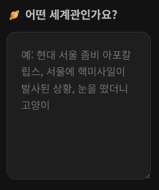
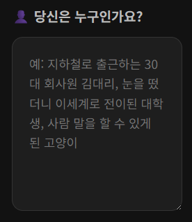
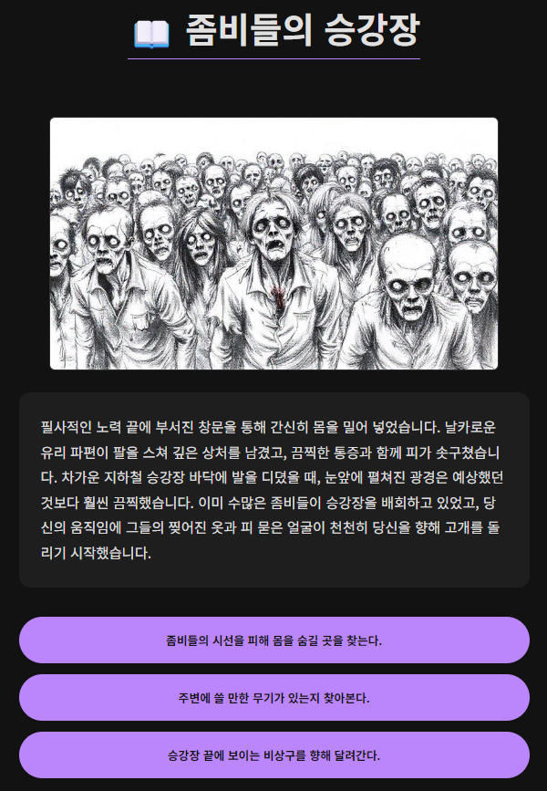

# UCTale

> 사용자가 만든 세계와 캐릭터를 바탕으로 이야기를 이어가는 AI 텍스트 어드벤처


UCTale은 사용자가 직접 입력한 세계관과 주인공 설정을 바탕으로 이야기를 생성하는 텍스트 어드벤처입니다.

플레이어는 매 턴 제시되는 선택지 가운데 하나를 고르고, 선택에 따라 다음 장면과 선택지가 이어집니다. 장면에 시각적으로 보여줄 요소가 있을 때는 이야기와 함께 삽화도 생성합니다.

[서비스 바로가기](https://uctale.vercel.app/)

---

## 게임 화면

### 게임 시작

| 세계관 설정 | 주인공 설정 |
| :---: | :---: |
|  |  |
| 플레이하고 싶은 세계와 분위기를 직접 입력합니다. | 이야기의 주인공이 될 캐릭터를 직접 설정합니다. |

### 이야기 진행

| 생성 이미지 예시 |
| :---: |
|  |
| Pollinations를 사용한 UCTale charcoal 계열 이미지 |

---

## 플레이 방식

1. 공유 베타 접근 비밀번호를 확인해 단기 접근 세션을 발급받습니다.
2. 원하는 세계관과 주인공을 입력합니다.
3. 서버가 입력 내용을 바탕으로 첫 장면과 선택지를 생성합니다.
4. 플레이어가 선택지를 고르면 다음 턴이 진행됩니다.
5. 서버는 현재 턴과 게임 상태를 저장하고, 필요한 문맥만 Narrative Engine에 전달합니다.
6. 시각적으로 표현할 장면이 있으면 서버가 발급한 image asset을 통해 삽화를 제공합니다.

현재 플레이는 AI가 모든 게임 상태를 임의로 결정하는 방식이 아니라, 장기적으로 서버가 게임의 사실과 규칙을 소유하고 LLM은 그 결과를 이야기로 표현하는 구조를 목표로 개발하고 있습니다.

---

## 현재 구현된 내용

### 공유 베타 접근 제어와 세션 소유권

- 비밀번호 검증 성공 시 서버가 서명한 단기 접근 세션을 HttpOnly 쿠키로 발급합니다.
- 별도의 장기 owner key로 게임 세션 소유권을 서버와 DB에서 관리합니다.
- 다른 owner는 session ID를 알아도 해당 세션을 조회하거나 진행할 수 없습니다.
- 게임 시작, 턴 진행, 이미지 asset API는 유효한 접근 세션이 있어야 호출할 수 있습니다.
- 운영 기본 CORS origin은 `https://uctale.vercel.app`만 허용하며, 허용 origin은 환경변수로 명시적으로 관리합니다.
- 접근 세션이 만료되거나 유효하지 않으면 프론트엔드가 재인증 화면으로 전환합니다.
- 공유 비밀번호 인증 실패는 별도의 IP 기반 rate limit으로 보호합니다.

### 이야기 생성과 선택지 진행

- 세계관과 캐릭터 설정을 입력해 새 게임 세션을 시작할 수 있습니다.
- Gemini가 현재 문맥을 바탕으로 이야기와 다음 선택지를 생성합니다.
- 클라이언트는 서버가 반환한 `sessionId`와 현재 턴을 기준으로 다음 진행 요청을 보냅니다.
- 오래된 턴이나 중복 진행 요청은 서버에서 충돌로 처리합니다.
- provider 응답의 필수 필드, 길이, 선택지 ID 중복 등을 저장 전에 검증합니다.

### GameState와 Story Memory

게임의 장기 문맥을 단순히 전체 대화 기록으로 다시 전달하지 않습니다.

서버는 세션별 `GameState`를 저장하고, Narrative Engine에는 다음 정보를 구분해 전달합니다.

- `canonicalFacts`: 서버가 유지하는 장기 사실
- `rollingSummary`: 오래된 진행 내용을 압축한 기록
- `recentTurns`: 가장 최근 6턴

최신 상태는 `game_state_snapshot`에 JSON 스냅샷으로 저장하며, 세션과 턴 기록은 별도로 유지합니다.

현재 이 구조는 이후 능력치, 전투, 인벤토리, 퀘스트 같은 서버 주도 게임 규칙을 추가하기 위한 기반 단계입니다.

### 턴 저장과 무결성

- 세션마다 현재 턴 번호와 optimistic-lock version을 관리합니다.
- 진행 요청은 `expectedTurn`을 포함합니다.
- 동일 세션에서 같은 턴이 중복 저장되지 않도록 DB 제약과 서버 검증을 함께 사용합니다.
- AI 호출은 긴 DB transaction 밖에서 수행합니다.
- AI 또는 저장 실패가 발생해도 불완전한 다음 턴이 남지 않도록 처리합니다.

현재 M2에서는 여기서 더 나아가 idempotency key, turn reservation/lease, append-only committed-turn ledger와 PostgreSQL 동시성 회귀 검증을 추가하는 중입니다.

### 이미지 생성

- Pollinations를 통해 게임 장면에 사용할 이미지를 생성합니다.
- 클라이언트는 임의 prompt를 provider에 전달할 수 없고, 서버가 발급한 session/turn-scoped image asset만 요청할 수 있습니다.
- Provider 토큰과 내부 URL은 서버 밖으로 노출하지 않습니다.
- 동일 asset은 저장된 model, prompt, size, seed, style version을 재사용합니다.
- 기본 정책은 `flux`, `768x432`, `uctale-charcoal-v2`이며 환경 설정으로 변경할 수 있습니다.
- provider 오류가 발생해도 canonical game turn은 유지되고, 이전 이미지 또는 fallback으로 게임을 계속 진행할 수 있습니다.

### 비용 보호와 관측성

- Narrative와 Image 비용 API는 owner/IP/session 기준의 in-process rate limit을 적용합니다.
- Narrative와 Image quota는 독립적으로 조정할 수 있습니다.
- provider 호출마다 provider, operation, session, turn, request ID, latency, outcome, retry count를 구조화 로그로 기록합니다.
- prompt/응답 전문, 비밀번호, API key, access/owner token은 관측 로그에 남기지 않습니다.
- 현재 limiter는 단일 애플리케이션 인스턴스 기준이며 multi-instance 환경에서는 전역 quota를 보장하지 않습니다.

### 프론트엔드 UX

- Charcoal Folio 기반의 narrative-first single-column UI를 사용합니다.
- `system | light | dark` 테마와 SUIT Variable typography를 지원합니다.
- API 오류는 browser `alert()` 대신 화면 문맥 안에서 표시하고 가능한 경우 retry를 제공합니다.
- 진행 중 중복 요청을 막고, typewriter skip 및 `prefers-reduced-motion`을 지원합니다.
- image loading/failure, keyboard focus 이동, live-region 등 공유 베타용 accessibility behavior를 보강했습니다.
- Vercel Web Analytics를 통해 production page view를 확인할 수 있습니다.

---

## 기술 스택

| 영역 | 기술 |
| :--- | :--- |
| Frontend | React 19, React Router 7, Vite 8, Axios |
| Backend | Java 21, Spring Boot 4.1, Spring Web MVC, Spring Data JPA |
| Database | PostgreSQL, Flyway |
| Test Database | H2, PostgreSQL integration test 도입 예정(M2) |
| Narrative AI | Google Gemini 2.5 Flash |
| Image AI | Pollinations |
| Deployment | Vercel, Render |

---

## 프로젝트 구조

```text
uctale/
├── frontend/                  # React 프론트엔드
├── src/main/java/            # Spring Boot 백엔드
├── src/main/resources/
│   ├── application.properties
│   └── db/                   # Flyway migration
├── src/test/                 # 백엔드 테스트
├── docs/                     # 설계 문서와 이미지
├── scripts/                  # benchmark/검증 도구
├── build.gradle
└── README.md
```

백엔드는 게임 진행 로직이 Gemini나 Pollinations의 구현 세부사항에 직접 의존하지 않도록 Provider 경계를 분리하고 있습니다.

핵심 방향은 다음과 같습니다.

- 게임의 결정적인 상태는 서버가 소유합니다.
- LLM은 확정된 문맥을 바탕으로 이야기를 생성합니다.
- 외부 AI Provider의 DTO와 호출 방식은 게임 도메인과 분리합니다.
- Provider 오류나 중복 요청이 저장된 게임 상태를 훼손하지 않도록 합니다.
- API Key와 토큰은 프론트엔드나 공개 응답에 포함하지 않습니다.

자세한 개발 원칙은 [CONTRIBUTING.md](./CONTRIBUTING.md), [GameState / Story Memory 설계 문서](./docs/architecture/game-state-story-memory.md), [비용 보호 문서](./docs/architecture/cost-controls.md), [이미지 생성 문서](./docs/architecture/image-generation.md)에서 확인할 수 있습니다.

---

## 로컬 실행

### 필요한 환경

- Java 21
- Node.js
- PostgreSQL
- Google AI API Key
- Pollinations Token

### 백엔드 환경 변수

```env
GOOGLE_AI_API_KEY=...
POLLINATIONS_TOKEN=...
GAME_ACCESS_PASSWORD=...
GAME_ACCESS_SESSION_SECRET=32자 이상의 충분히 긴 임의 문자열
GAME_ACCESS_COOKIE_SECURE=false
GAME_CORS_ALLOWED_ORIGINS=http://localhost:5173
DATABASE_URL=jdbc:postgresql://localhost:5432/uctale
DATABASE_USERNAME=...
DATABASE_PASSWORD=...
```

`GAME_ACCESS_COOKIE_SECURE=false`는 로컬 HTTP 개발용입니다. 운영에서는 기본값 `true`를 사용해 `Secure; SameSite=None` HttpOnly 쿠키를 발급합니다. 운영 CORS 기본값은 `https://uctale.vercel.app`이며, 다른 origin을 허용해야 할 때만 `GAME_CORS_ALLOWED_ORIGINS`를 쉼표로 구분해 명시합니다.

비용/인증/이미지 정책의 세부 환경변수는 `src/main/resources/application.properties`와 관련 architecture 문서를 기준으로 관리합니다.

### 백엔드 실행

macOS / Linux:

```bash
./gradlew bootRun
```

Windows:

```powershell
.\gradlew.bat bootRun
```

기본 포트는 `8080`입니다.

### 프론트엔드 실행

```bash
cd frontend
npm install
npm run dev
```

로컬 백엔드를 사용할 경우 별도 설정 없이 `http://localhost:8080/api/game`을 사용합니다.

다른 API 서버를 사용할 경우 `frontend` 환경 변수에 다음 값을 설정합니다.

```env
VITE_API_URL=https://example.com/api/game
```

---

## 테스트와 빌드

백엔드:

```bash
./gradlew clean test
./gradlew build
```

프론트엔드:

```bash
cd frontend
npm ci
npm test
npm run lint
npm run build
```

M2의 #73에서 실제 PostgreSQL 의미론을 검증하는 별도 integration-test task와 CI 실행 경계를 추가할 예정입니다.

---

## 개발 현황

### M1 — 공유 베타 운영 안전망

**완료.** production smoke test까지 통과한 상태입니다.

M1에서 완료한 주요 범위:

- 비용 발생 API validation과 안정적인 오류 계약
- 공유 접근 세션, CORS allowlist, 게임 세션 소유권
- 서버 발급 image asset과 Pollinations 생성 계약 보강
- Narrative/Image rate limit과 provider 관측성
- 공유 비밀번호 인증 시도 rate limit
- Charcoal Folio UI foundation과 interaction/accessibility UX
- Vercel Web Analytics
- production smoke에서 발견된 CORS/UI/image style 회귀 보완

### M2 — 턴 무결성·복구 기반

핵심 목표는 **같은 사용자 행동이 retry/concurrency/crash 상황에서도 canonical game state에 한 번만 commit되고, 저장된 결과를 복구·감사할 수 있게 하는 것**입니다.

권장 순서:

1. **#73** PostgreSQL integration test harness와 CI 기반
2. **#28** append-only committed-turn `GameLog` 원장
3. **#31** GameState snapshot schema/ruleset version + upgrader — #28과 병렬 가능
4. **#29** `/init`·`/progress` 게임 mutation idempotency
5. **#30** turn reservation/lease로 정상 동시 요청의 중복 provider 실행 억제
6. **#32** M2 PostgreSQL 동시성·migration·복구 최종 회귀 matrix

운영 보강 트랙인 **#70 production post-deploy smoke 자동화**, **#71 전역 AI 비용 budget guard**는 위 핵심 체인의 선행조건이 아니므로 병렬 또는 후순위로 진행합니다.

M2에서 strict external-provider exactly-once까지 약속하지는 않습니다. DB lease만으로는 provider 성공 직후 commit 전 프로세스 장애 같은 구간에서 재호출 가능성을 완전히 제거할 수 없기 때문에, **canonical commit exactly-once + 유효 reservation 구간의 중복 provider 억제 + bounded recovery**를 현실적인 보장 범위로 둡니다.

### 이후

M2가 안정되면 다음 단계에서 서버 주도 `AvailableAction`, `PlayerAction`, `GameResult`, 타입 안전한 캐릭터 능력치와 Skill Check를 연결하고, 이후 전투·인벤토리·퀘스트·NPC 관계 시스템으로 확장합니다.

아직 구현되지 않은 기능을 현재 기능처럼 문서에 표시하지 않고, 실제 main 코드와 완료된 작업을 기준으로 README를 갱신하는 것을 원칙으로 합니다.
